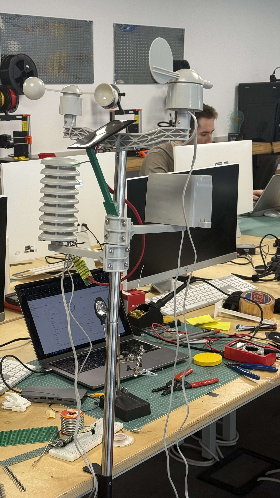
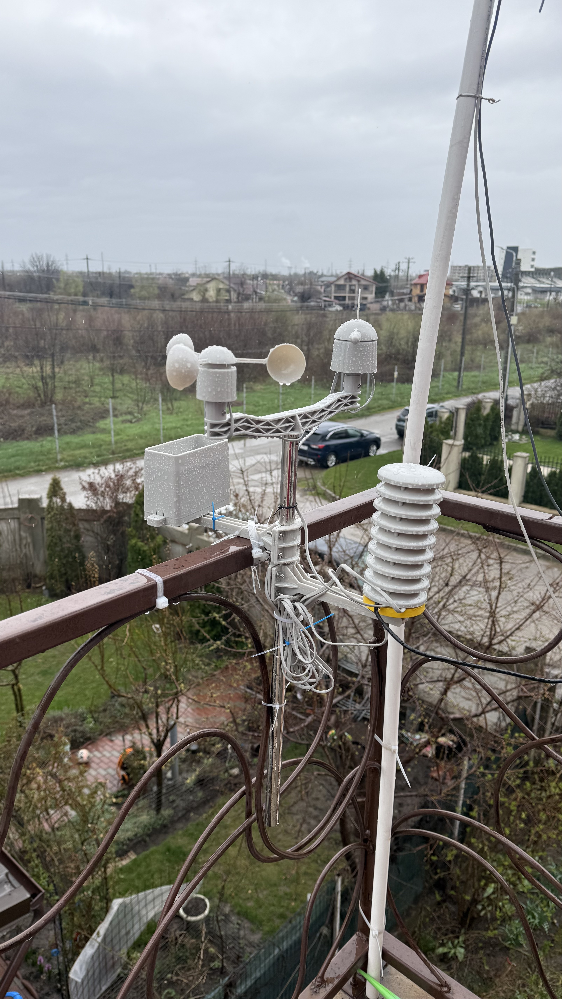
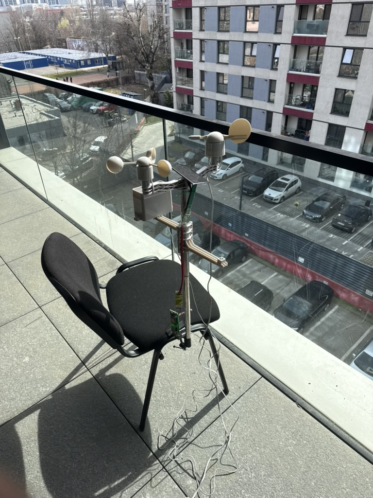
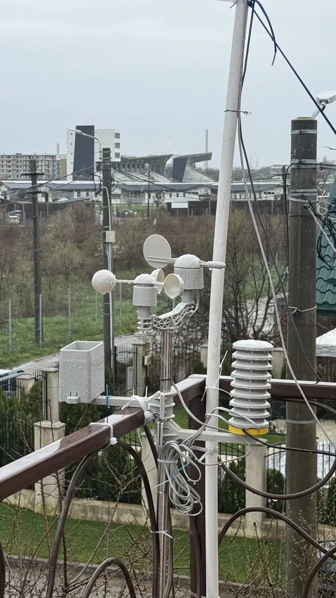
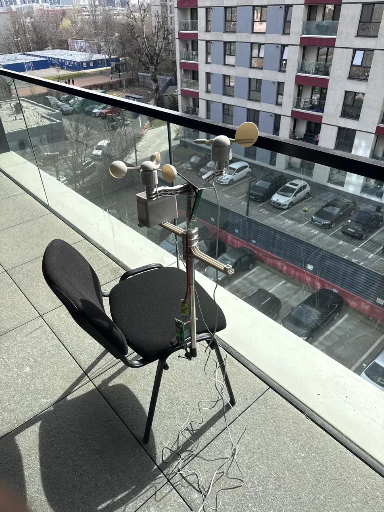

# iGround — Autonomous IoT Meteorological Station

A complete, end-to-end IoT weather station built from scratch: custom PCB, FreeRTOS firmware on an ESP32, a containerised backend on an NVIDIA Jetson Orin Nano, a multi-head LSTM forecasting pipeline, a Grafana dashboard, and a Flutter mobile app. The system has been running continuously and autonomously since **14 April 2026**.

---

## Gallery

### Lab prototype → balcony testing → final field deployment

| Lab assembly | First outdoor test | Field deployment |
|:---:|:---:|:---:|
|  |  |  |
| SparkFun weather meter mounted on test stand, breadboard wiring visible, first firmware tests in the lab | Early outdoor validation on a university balcony — breadboard ESP32 still exposed, weather meter fully assembled | Final deployment: custom PCB v2 in enclosure, Stevenson screen housing the BME280, full sensor suite on the balcony rail since 14 April 2026 |

### PCB design

| Front (3D render) | Back (3D render) | Schematic |
|:---:|:---:|:---:|
|  |  |  |
| Custom two-layer KiCad PCB v2 | Back copper layer, ground plane | Full circuit schematic |

> All hardware photos: Ploiești, Romania, 2026.

---

## Table of Contents

- [Overview](#overview)
- [Architecture](#architecture)
- [Hardware](#hardware)
- [Firmware (ESP32)](#firmware-esp32)
- [Backend](#backend)
- [Machine Learning & Forecasting](#machine-learning--forecasting)
- [Presentation Layer](#presentation-layer)
- [Deployment & Results](#deployment--results)
- [Getting Started](#getting-started)
- [Configuration](#configuration)
- [API Reference](#api-reference)
- [Troubleshooting](#troubleshooting)
- [File Structure](#file-structure)
- [License](#license)

---

## Overview

iGround measures temperature, humidity, barometric pressure, wind speed, wind direction, rainfall, and PM2.5 particulate matter in real time. Every 5 minutes the ESP32 edge node sends a JWT-authenticated HTTPS POST to a Flask backend running on the Jetson Orin Nano. Every 5 hours, a forecasting container retrains a multi-head LSTM and a Ridge regression model from scratch on all accumulated data and writes 5-hour ahead predictions back to Redis TimeSeries. A Grafana dashboard and a Flutter mobile app consume the data and forecasts in real time.

**Key numbers at a glance:**

| Metric | Value |
|--------|-------|
| Uptime since deployment | 30+ days continuous (since 14 Apr 2026) |
| Forecast cycles completed | ~144 autonomous (no manual intervention) |
| Temperature forecast MAE | 0.29 °C (within BME280 ±0.5 °C spec) |
| Humidity forecast MAE | 0.92 %RH (within BME280 ±3 %RH spec) |
| Pressure forecast MAE | 0.018 hPa (Ridge regression) |
| Sensor polling interval | 5 minutes |
| Forecast retraining interval | 5 hours |

---

## Architecture

```
┌──────────────────────────────────────────────────────────────────┐
│  Edge Node                                                       │
│  ESP32-WROOM-32 · Custom PCB v2                                  │
│  BME280 · GP2Y · SparkFun Weather Meter                          │
│  FreeRTOS · ESP-IDF · mbedTLS HMAC-SHA256 JWT                    │
└────────────────────────┬─────────────────────────────────────────┘
                         │ HTTPS POST /sensor  (JWT, every 5 min)
                         ▼
┌──────────────────────────────────────────────────────────────────┐
│  Gateway — NVIDIA Jetson Orin Nano (JetPack 6.x)                 │
│                                                                  │
│  ┌─────────────┐  ┌──────────┐  ┌────────┐  ┌────────────────┐   │
│  │ Flask + AAA │  │  MySQL   │  │ Redis  │  │  Forecasting   │   │
│  │ Gunicorn    │─►│ audit log│  │ Time   │  │  Container     │   │
│  │ Nginx/TLS   │  └──────────┘  │ Series │◄─│  LSTM + Ridge  │   │
│  └─────────────┘                └───┬────┘  │  (every 5h)    │   │
│                                     │       └────────────────┘   │
│  (all services managed by Docker Compose)                        │
└─────────────────────────────────────┬────────────────────────────┘
                                      │
                    ┌─────────────────┴──────────────────┐
                    │                                    │
                    ▼                                    ▼
          ┌──────────────────┐               ┌─────────────────────┐
          │ Grafana Dashboard│               │  Flutter Mobile App │
          │ (browser, local) │               │  Android · iOS      │
          └──────────────────┘               └─────────────────────┘
```

### Data flow summary

1. ESP32 reads sensors, signs a JWT with the shared HMAC-SHA256 secret, and POSTs to `/sensor`.
2. Flask verifies the JWT signature and validates the chip-ID against a producer whitelist (AAA model).
3. Validated readings are written to Redis TimeSeries keys `sensor:{chip_id}:{metric}` and compacted hourly to `sensor:{chip_id}:{metric}:hourly`.
4. Every 5 hours the forecasting container starts, reads all data from Redis, retrains the LSTM and Ridge models, writes 10 forecast rows per metric to `forecast:{metric}` keys, and exits.
5. Grafana reads all keys via the Redis TimeSeries datasource plugin and serves data to both the browser dashboard and the Flutter app through its REST API (`/api/ds/query`).

---

## Hardware

### Custom PCB (v2)

Designed in KiCad, manufactured as a two-layer board. The second revision corrected all first-iteration footprint errors and added IP65-compatible enclosure mounting points.

**Bill of Materials (key components):**

| Component | Part | Notes |
|-----------|------|-------|
| Microcontroller | ESP32-WROOM-32 | Dual-core, Wi-Fi, hardware AES/SHA |
| T/H/P sensor | Bosch BME280 | I²C 0x76, replaces SHT21 + MS5611 |
| Dust sensor | Sharp GP2Y1010AU0F | Optical, 320 µs LED pulse |
| Weather meter | SparkFun SEN-15901 | Anemometer, vane, rain gauge |
| LDO regulator | AMS1117-3.3 | 5 V → 3.3 V, ~96 mA typical |
| Protection diode | 1N4148 | Reverse-polarity protection |

**Power budget:** ~96 mA typical, ~271 mA peak (during TLS handshake).

### Development phases

The station went through three physical iterations before the final deployment:

| Phase | Description |
|-------|-------------|
| Breadboard | Initial sensor wiring, Arduino framework, SHT21 + MS5611 |
| Perfboard | First semi-permanent layout, sensor replacement with BME280 |
| Custom PCB v2 | KiCad two-layer board, fixed footprints, enclosure mounting |

---

## Firmware (ESP32)

Written in C using the native **ESP-IDF** toolchain (migrated from Arduino for SMP FreeRTOS and hardware crypto access).

### FreeRTOS task layout

| Task | Stack | Description |
|------|-------|-------------|
| `rest_worker_task` | 16 384 B | JWT generation (mbedTLS HMAC-SHA256) + HTTPS POST |
| `bme280_task` | 4 096 B | I²C forced-mode read, compensation math |
| `wind_speed_task` | 2 048 B | ISR-driven anemometer pulse counter |
| `wind_vane_task` | 2 048 B | ADC + 16-direction lookup table |
| `rain_task` | 2 048 B | ISR-driven tipping bucket counter (0.2794 mm/tip) |
| `gp2y_task` | 2 048 B | 320 µs LED pulse, ADC sample at 280 µs |

> **Note on stack size:** `rest_worker_task` uses 16 KB because mbedTLS TLS handshake,
> HMAC-SHA256, and JSON serialisation all run in the same task context.
> The value was determined with `uxTaskGetStackHighWaterMark()`.

### Security

- JWT signed with HMAC-SHA256 using the mbedTLS hardware accelerator.
- TLS 1.2 over HTTPS for all communication.
- Chip-ID embedded in every JWT payload for server-side device whitelisting.

### Known hardware quirks fixed

- **ADC non-linearity:** mitigated with `esp_adc_cal_characterize()` + `esp_adc_cal_raw_to_voltage()`. Error reduced from ±150 mV to ±30 mV.
- **BME280 I²C clock stretching:** `i2c_set_timeout()` set to 40 ms to avoid false `ESP_ERR_TIMEOUT` during the 2 ms measurement window.

---

## Backend

All services run on the Jetson Orin Nano via **Docker Compose**.

### Services

| Service | Image | Role |
|---------|-------|------|
| `flask` | custom | REST API, JWT verification, AAA |
| `gunicorn` | custom | WSGI server for Flask |
| `nginx` | nginx:alpine | TLS termination, reverse proxy |
| `mysql` | mysql:8 | Audit log, user/device registry |
| `redis` | redis/redis-stack | TimeSeries data store |
| `grafana` | grafana/grafana | Dashboard + API middleware |
| `forecast` | custom (TF2/CUDA) | Runs every 5 h, then exits |

### Redis key schema

```
sensor:{chip_id}:{metric}           # raw 5-min readings
sensor:{chip_id}:{metric}:hourly    # auto-compacted hourly aggregates
forecast:{metric}                   # 10-step 5-h ahead predictions
```

### AAA security model

Every incoming request goes through **Authentication** (JWT signature check),
**Authorisation** (chip-ID whitelist match), and **Accounting** (MySQL audit log entry).
Unauthenticated or unknown devices are rejected at the Flask layer before any data reaches Redis.

---

## Machine Learning & Forecasting

The forecasting container runs on the Jetson's **1024-core Ampere GPU**
(CUDA 12.6, driver 540.4.0, JetPack 6.x). Because the Jetson uses unified LPDDR5 memory,
tensors built from Redis data are immediately accessible to the GPU with no explicit copy.

### Model architecture

| Variable | Model | Rationale |
|----------|-------|-----------|
| Temperature | Multi-head LSTM (shared trunk) | Strong diurnal pattern, T-H coupling |
| Humidity | Multi-head LSTM (shared trunk) | Clausius-Clapeyron coupling with T |
| Pressure | Ridge regression | R²=0.238 vs temperature — largely independent, autocorrelation dominates |
| Rain probability | Sigmoid of ΔP tendency | Falling pressure → precipitation risk |

The T-H coupling is the key architectural insight: temperature and humidity share an LSTM
trunk with separate output heads, allowing the model to exploit the inverse
Clausius-Clapeyron relationship directly.

### Training results (held-out test set)

| Model | MAE | RMSE |
|-------|-----|------|
| Temperature (LSTM) | 0.2906 °C | 0.4256 °C |
| Humidity (LSTM) | 0.9198 %RH | 1.2605 %RH |
| Pressure (Ridge) | 0.0178 hPa | 0.0245 hPa |

Both LSTM results are within the BME280's own sensor accuracy specification.

### Retraining lifecycle

```
[scheduler triggers every 5h]
  → forecasting container starts
  → reads all data from Redis TimeSeries
  → retrains LSTM + Ridge from scratch on full dataset
  → writes 10-row forecast to forecast:* keys
  → container exits
```

Each retraining run takes approximately **7–10 minutes** on the Jetson GPU.

---

## Presentation Layer

### Grafana Dashboard

Serves as both a monitoring dashboard and a **data API middleware** for the Flutter app.
The Flutter app never connects to Redis directly — all data goes through Grafana's
`/api/ds/query` endpoint using Basic Auth.

Dashboard rows:
1. Live scalar gauges (T, H, P, wind, rain, PM2.5, battery)
2. Time-series charts (configurable window: 5 min → 30 days)
3. Wind and rainfall panels
4. 5-hour forecast overlay (dashed line over live series)

### Flutter Mobile App

Cross-platform (Android + iOS), connects to Grafana's REST API over HTTPS.

**Key endpoints used:**

| Endpoint | Purpose |
|----------|---------|
| `GET /api/user` | Authentication (Basic Auth) |
| `GET /api/user/orgs` | Role detection (viewer/editor/admin) |
| `POST /api/ds/query` | Sensor data + forecasts from Redis |
| `GET /api/admin/users` | User management (admin only) |

**Architecture:** three-layer — `GrafanaService` singleton →
`StatefulWidget` with `Timer.periodic(5s)` + `Future.wait` → stateless UI widgets.

---

## Deployment & Results

| Metric | Value |
|--------|-------|
| Deployment start | 14 April 2026 |
| Continuous uptime | 30+ days |
| Forecast cycles | ~144 (no manual restarts) |
| Dataset size (May 2026) | ~7 580 hourly rows and growing |
| Retraining time | 7–10 min/cycle on Jetson GPU |
| Redis write latency | < 1 s (pipeline batch) |

The pressure model MAE varied slightly across deployment (0.0145–0.0187 hPa),
with a temporary increase during a frontal passage on 12–13 May.
The model recovered as new data from that weather regime was accumulated —
expected behaviour for a continuously retrained model.
